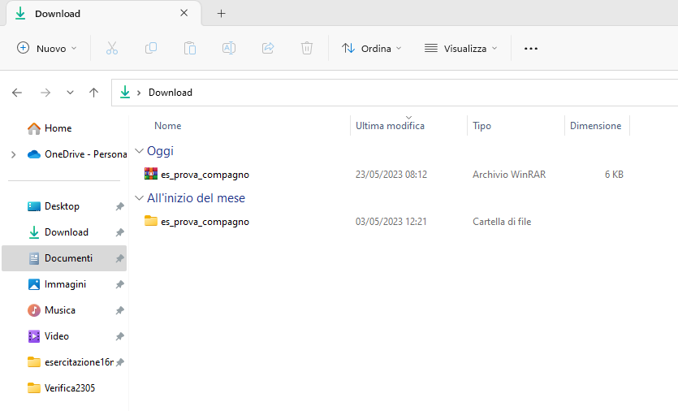
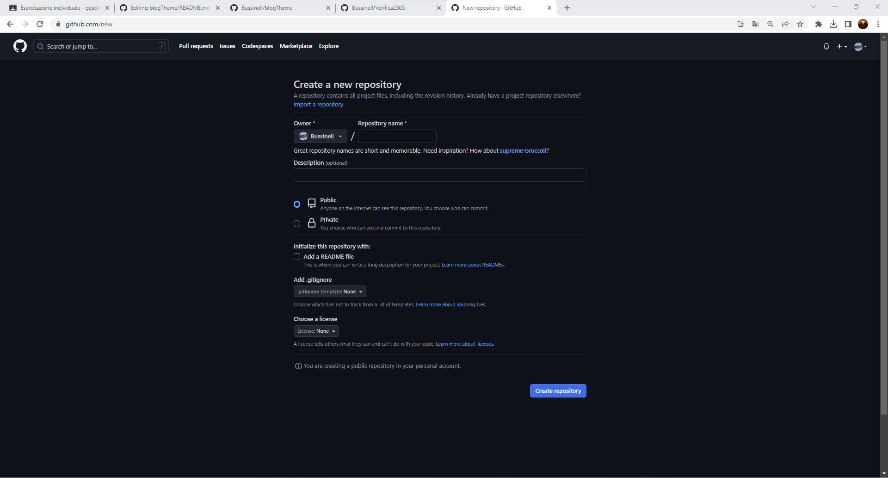
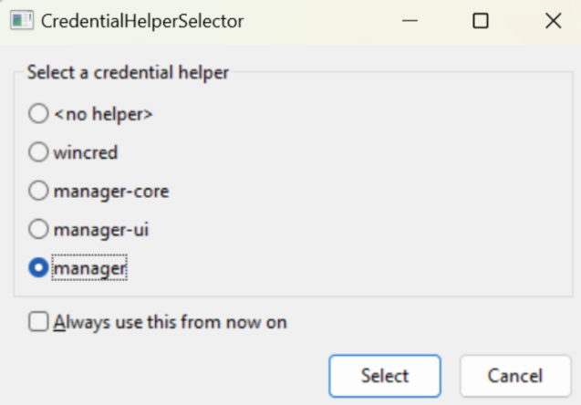
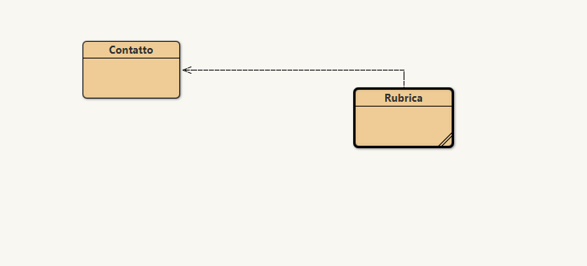

# TUTORIAL: verifica del 23/05/2023

# download dell'esercizio di informatica
nome del file: ``` es_prova_compagno ```



# Creare una cartella 
 creare una cartella nominata ``` Verifica2305 ```, e scrivere questo comando su git-bash:

```
cd $HOME/path/to/<Verifica2305>
```
dove ``` path/to/ ``` rappresenta il percorso del file.
Creare un file ``` README.md ``` in Blocco note, che sarà il readme file del repository Git, e scrivere al suo interno la traccia dell'esercitazione indicata su Classroom. Salvare il file.

# Creare una repository su GitHub
* aprire il sito github.com
* Effettuare il login
* Cliccare su ``` new ```


* Creare un nuovo repository chiamato come la cartella.


# Configurazione del repository locale e sincronizzazione
Da ``` git-bash ``` eseguire i seguenti comandi:
```
git init
git add README.md
git commit -m "first commit"
git branch -M main
git remote add origin https://github.com/<username>/Verifica2305
git push -u origin main
```
Nel caso in cui appaia questa finestra



selezionare ``` manager ```.

# Esercizio java:
utilizza la struttura dati corretta per il seguente problema:
Sia data una classe Contatto le cui istanze rappresentano contatti telefonici. Ogni contatto ha un nome, un cognome e un numero telefonico (tutti di tipo String), un costruttore che riceve come parametro il nome, il cognome e il numero di telefono associati al contatto, metodi per leggere tali valori e il metodo toString() che restituisce una rappresentazione testuale del contatto. Scrivere una classe Rubrica che rappresenta una collezione di contatti. La classe memorizza i contatti per mezzo di una lista ed è dotata dei seguenti metodi: 
 void aggiungiContatto(String nome, String cognome, String telefono) che aggiunge un contatto alla rubrica;  
void rimuoviContatto(String nome, String cognome) che rimuove dalla rubrica il contatto associato al nome e cognome dati;  
String cerca(String nome, String cognome) che dato un nome e cognome restituisce il numero di telefono associato a quel nome e cognome oppure null se il nome e cognome non sono presenti in rubrica;  String toString() che restituisce una descrizione testuale dell’intera rubrica.

# Inserire i file dell'esercizio:
prendere i file dell'esecizio dalla cartella ``` es_prova_compagno ``` e inserirli nella cartella collegata al repository locale, su ``` git bash ``` eseguire i seguenti comandi:
* ``` git add * ``` per inserire tutti i file
* ``` git commit -m "first commit" ```
* ``` git remote add origin https://github.com/<username>/Verifica2305.git ```
* ``` git branch -M main ```
* ``` git push -u origin main ```

# descrizione del codice:



nella classe ``` Contatto ``` si trova una descrizione di un singolo contatto come ad esempio:
* nome;
* cognome;
* numero di telefono.
nella classe ``` Rubrica ``` si trova una struttura dati che salva i contatti:
