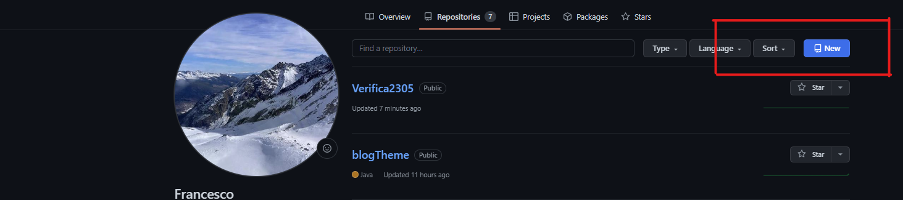

# TUTORIAL: verifica del 23/05/2023

# download dell'esercizio di informatica
nome del file: ``` es_prova_compagno ```


# Creare una cartella nominata ``` Verifica2305 ```, e scrivere questo comando su git-bash:

```
cd $HOME/path/to/<nomeDellaCartella>
```
dove ``` path/to/ ``` rappresenta il percorso del file.
Creare un file ``` README.md ``` in Blocco note, che sarà il readme file del repository Git, e scrivere al suo interno la traccia dell'esercitazione indicata su Classroom. Salvare il file.

# Creare una repository su GitHub
* aprire il sito github.com
* Effettuare il login
* Cliccare su ``` new ```



* Creare un nuovo repository chiamato come la cartella.


# Configurazione del repository locale e sincronizzazione
Da ``` git-bash ``` eseguire i seguenti comandi:
```
git init  # Inizializza il repository locale
git add README.md  # Inserimento del file README.md nell'area di staging
git commit -m "first commit"  # Creazione del primo commit, che serve a sincronizzare il repository locale con lo stage
git branch -M main  # Creazione del branch main, da usare come default
git remote add origin https://github.com/<username>/Esercitazione16maggio  # Connessione del repository remoto al repository locale
git push -u origin main  # Sincronizzazione del repository remoto con quello locale
```
Nel caso in cui appaia questa finestra


selezionare ``` manager ```.

